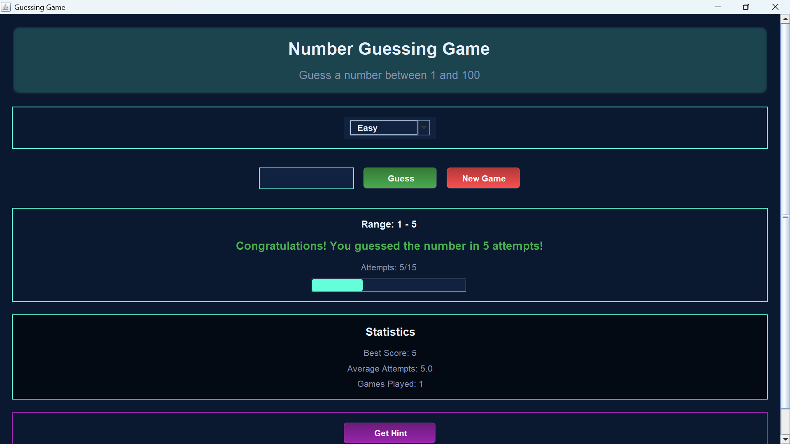
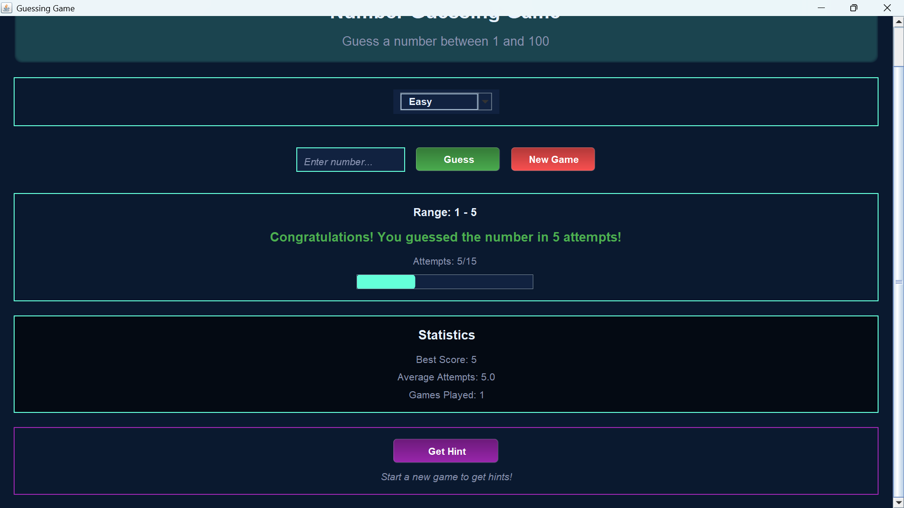

# 🎮 Number Guessing Game

A modern, interactive number guessing game built with Java Swing, featuring an elegant user interface and engaging gameplay mechanics.

## 📸 Screenshots




## ✨ Features

- **Modern UI Design**
  - Sleek, dark-themed interface with vibrant accents
  - Smooth animations and transitions
  - Dynamic background effects with floating bubbles
  - Responsive layout that adapts to window resizing

- **Game Mechanics**
  - Random number generation between 1 and 100
  - Multiple difficulty levels (Easy, Medium, Hard)
  - Real-time feedback on guesses
  - Hint system to assist players
  - Progress tracking with visual indicators

- **Statistics & Analytics**
  - Track high scores
  - Monitor average attempts
  - Record games played
  - Visual progress bar for remaining attempts

## 🚀 Getting Started

### Prerequisites

- Java Development Kit (JDK) 8 or higher
- An IDE that supports Java (IntelliJ IDEA recommended)

### Installation

1. Clone the repository:
   ```bash
   git clone https://github.com/tesso30/GuessingGame.git
   ```

2. Open the project in your IDE:
   - If using IntelliJ IDEA: File → Open → Navigate to the cloned directory

3. Build and run the project:
   - Build: Build → Build Project
   - Run: Right-click on `GuessingGameApp.java` → Run 'GuessingGameApp.main()'

## 🎯 How to Play

1. Select your preferred difficulty level:
   - Easy: 15 attempts
   - Medium: 10 attempts
   - Hard: 7 attempts

2. Enter your guess in the input field

3. Use the feedback to adjust your next guess:
   - "Too high!" - Try a lower number
   - "Too low!" - Try a higher number
   - "Congratulations!" - You've won!

4. Use the hint system if you need assistance

## 🛠️ Technical Details

### Project Structure

```
GuessingGame/
├── src/
│   ├── GuessingGameApp.java      # Main application class
│   ├── GuessingGameForm.java     # UI components and game logic
│   └── GuessingGameForm.form     # UI layout file
└── screenshots/                  # Game screenshots
```

### Key Components

- **GuessingGameApp.java**: Main class that initializes the game and manages the application lifecycle
- **GuessingGameForm.java**: Contains the UI implementation and game logic
  - Custom animations and effects
  - Event handling
  - Game state management
  - Statistics tracking

## 🎨 UI Features

- **Dynamic Background**
  - Animated floating bubbles
  - Gradient effects
  - Responsive grid patterns

- **Interactive Elements**
  - Gradient buttons with hover effects
  - Custom-styled input fields
  - Progress indicators
  - Animated feedback messages

## 🤝 Contributing

Contributions are welcome! Please feel free to submit a Pull Request or open an Issue if you have any suggestions or bug reports.

## 📝 License

This project is open source and available under the [MIT License](LICENSE).

## 👤 Author

- **Tesso Jemal**
  - GitHub: [@tesso30](https://github.com/tesso30)
  - Email: tessojemal@gmail.com

## 🙏 Acknowledgments

- Java Swing community for UI components
- IntelliJ IDEA team for the excellent IDE
- All contributors and users of the game

---

⭐ Star this repository if you find it useful! 